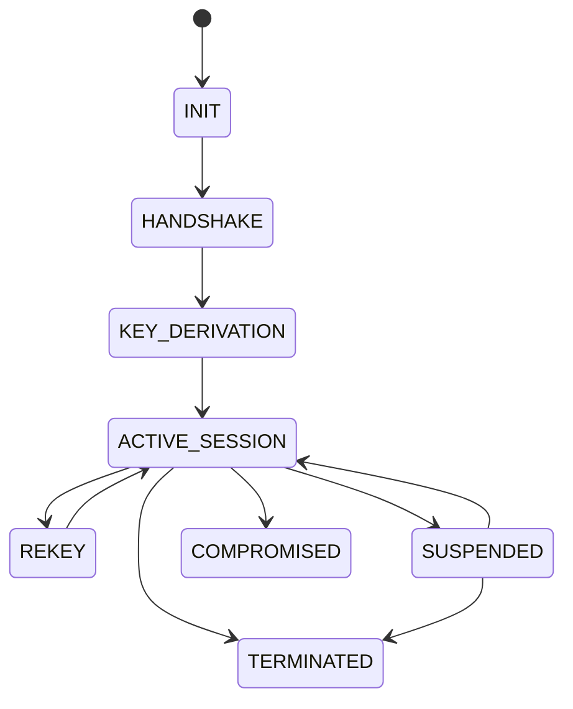

# SpectrumQ Protocol State Machine

## Overview

This document formalizes the lifecycle states of a SpectrumQ session.
It defines valid transitions between cryptographic and messaging states.

---

## States

### 1. INIT
Initial state before any cryptographic material is exchanged.

### 2. HANDSHAKE
Active key exchange phase (PQXDH hybrid handshake).

### 3. KEY_DERIVATION
Session keys are derived from handshake output.

### 4. ACTIVE_SESSION
Secure messaging is fully enabled.

### 5. REKEY
Ratchet step occurs; new message keys derived.

### 6. SUSPENDED
Session paused due to inactivity or network disruption.

### 7. TERMINATED
Session permanently closed; keys invalidated.

### 8. COMPROMISED (terminal failure state)
Entered when cryptographic integrity is no longer trusted.

---

## State Transition Diagram (Mermaid)

---

## Security Notes

- COMPROMISED is irreversible
- TERMINATED sessions must never be reused
- REKEY events MUST occur frequently to maintain forward secrecy
- ACTIVE_SESSION is the only state where messages are transmitted